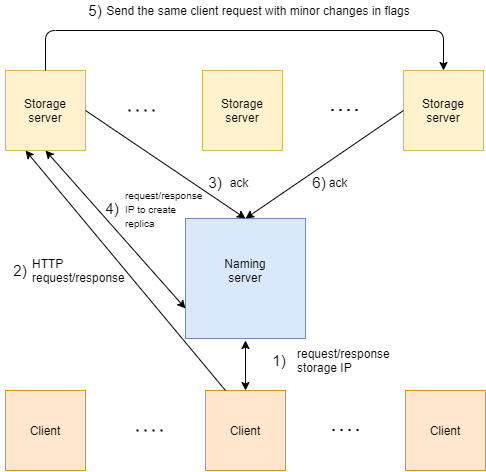

# Simple-Distributed-File-System
Innopolis University Assignment II. Distributer File System

# Documentation how to launch and use your system

## Using Docker
Firstly we need to pull the repo from GitHub.

Secondly - pull the images "thelawds/storage_node" and "thelawds/naming_node" from the DockerHub.

```docker
docker pull thelawds/storage_node
docker pull thelawds/naming_node
```

From the project directory, type ```docker docker-compose up``` to build the app and run it.

## From scratch

# Architectural diagrams
1) When Client want to do some operation in the system it connects to the Naming Server and request the IP adress of the Storage Node. Naming server randomly choose the Storage through all available Servers and response.
2) Client and Server exchange HTTP messages between each other to make the operation.
3) When Storage Server receives all the data it sends the acknoledgment to the Naming Server
4) and request the IP adress of one more Storage Server with enough amount of memory to save the replica of the data in it.
5) After that the first Server sends the same client request with minor changes in flags to the second server.
6) When the second Storage Server receives all data it sends an ack to the Naming server and it, in it's turn, make a record in the database.


## Naming Node
In our project Naming Server tracks the file system directory tree using the Postgres database. When a client wishes to perform an operation on a file, it first contacts the Naming Server to obtain the Storage Server IP. Naming Node generates the random number to choose one of the available Storage Nodes. Also every 60 seconds Name Node chacks the storages heartbits to register their presence. If nodes are failed than Naming Server drops them from the database. Within this checking operation Name Server also replicate the content which was saved only in one storage.


## Storage Nodes
Storage servers provide clients with access to it's local file system and several operations with files, such as initialization, file creation, file reading, file writing, file deletion, directory opening and derectory reading. Also Storage Server can interact with the Naming Server to transparently perform replication of files.


## Database
This is the Postgres database which consists of three tables: "file_information", "storage_node" and "file_information_to_storage_node". Let's talk about each separately.
File_information table help us to save the info about each file, such as it's id, path, last_update, size, executability, readability and writeability. Storage_node table save all storage nodes info: name, address, state and the amount of free space. The last one is a many to many relationship which map files' information to the Storage Nodes.

# Description of communication protocols

# Contribution of each team member
Murashko Alecsey - SE_01

Anna Gorb - SE_02
